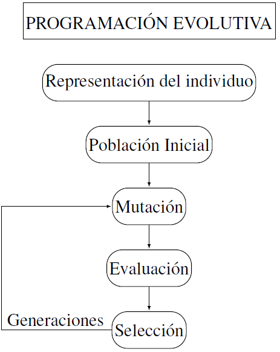
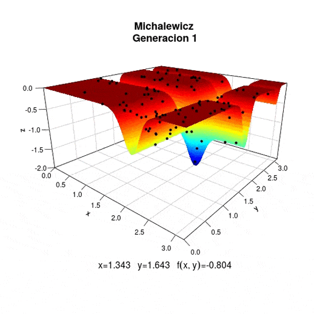
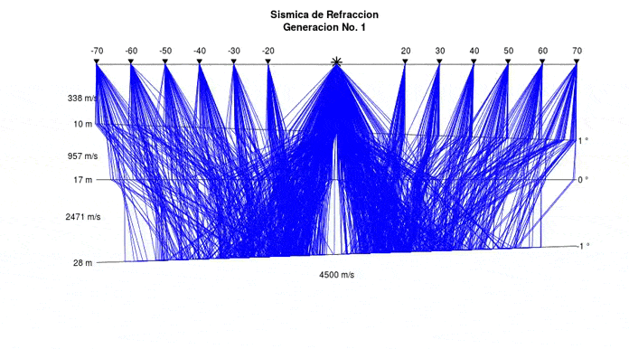

Programación Evolutiva
================
Jorge Merlo
6/6/2021

Los métodos de búsqueda u optimización global utilizan procesos
aleatorios para generar modelos dentro del espacio de búsqueda completo.
Estos modelos son evaluados por medio de una función objetivo para
determinar su calidad como solución al problema.

Al tener la posibilidad de explorar cualquier punto del espacio de
búsqueda, reducen la tendencia de converger a un mínimo local y aumentan
la probabilidad de que la solución final corresponda a la solución
global del problema.

Dentro de los métodos de optimización global se encuentran los
algoritmos evolutivos que simulan los principios evolutivos de la
naturaleza para guiar su búsqueda hasta la solución óptima. La técnica
utilizada en el presente estudio para resolver el problema de
optimización se llama Programación Evolutiva (PE), cuyo diagrama de
flujo es presentado en la siguiente imagen

``` r

```

<!-- -->

El propósito en este documento es implementar la PE para dar solución a
problemas de optimización. Se proporcionan funciones listas para ser
usadas y que pueden ser modificadas con facilidad. Para ello en la
siguiente sección definimos y encontramos el mínimo de la función de
Michalewicz.

## Óptimo de la función de Michalewickz

Definimos la función de Michalewickz en 2-D como función objetivo, de
esta manera el problema consiste en encontrar dentro del rango \[0, 3\]
los valores *x*<sub>1</sub> y *x*<sub>2</sub> tal que minimizen:

<!-- $f(x_1,x_2)= -(sin(x_1) \cdot (\frac{sin(x_1^2)}{\pi})^{2m} -(sin(x_2) \cdot (\frac{sin(x_2^2)}{\pi})^{2m})$ -->

``` r
knitr::include_graphics("Michalewicz.PNG")
```

<!-- -->

que tiene un mínimo *f*(*x*<sub>1</sub>, *x*<sub>2</sub>) =  − 1.8013 en
(*x*<sub>1</sub>, *x*<sub>2</sub>) = (2.20, 1.57). Se utilizó una
población de 100 individuos y 100 generaciones para alcanzar el mínimo
global. La búsqueda de generación en generación para alcanzar el mínimo
global se resume en la siguiente animacion,



Los códigos para generar la anterior animación se encuentra en la
carpeta **tal** adjunta en el presente repositorio. Se pueden modificar
de manera facil adaptandose a las necesidades del usuario.

## Aplicación en Geofísica

Se desarrolla una aplicación de la PE para modelar el trazado de rayos
sísmicos en la Refracción Sísmica que es uno de los métodos de la
geofísica aplicada. En este método se mide el tiempo de propagación de
las ondas elásticas, transcurrido entre un sitio donde se generan ondas
sísmicas y la llegada de éstas a diferentes puntos de observación
(geófonos) para poder determinar las velocidades correspondientes a los
materiales del subsuelo, a continuación se presenta graficamente esta
metodología,

``` r
knitr::include_graphics("RS.PNG")
```

<!-- -->

En la anterior imagen se pueden observar las velocidades
(*v*<sub>1</sub>, *v*<sub>2</sub>, *v*<sub>3</sub>, .., *v*<sub>*n*</sub>)
correspodientes a cada capa del subuselo, estas variarán dependiento del
material que las conformen, lo cual en la imagen se puede apreciar por
los cambio en la litologías (consultar litología en **Burger**).

El principal objetivo en Sísmica de Refracción es estimar las
velocidades que nos permitirá una caracterización del subsuelo,
determinar las condiciones (meteorización, fracturación) y competencia
de la roca. Así como la detección de fallas geológicas.

En el presente estudio se simula el trazado de rayos de refracción
sísmica estableciendo los parámetros del subsuelo (capas y velocidades).
Así como una fuente de propagación sísmica que nos permitirá modelar el
viaje de las ondas hasta los geófonos.

Este problema se puede ver como un problema de optimización ya que la
onda toma el camino que lleva al tiempo de arribo minimo entre
fuente-geófono. Para resolver este problema se hace uso de la PE con la
que generación tras generación se llega a a los Trazados de Rayos
Sismicos óptimos, es decir, aquellos que lleven al tiempo de arribo
minimo entre fuente-geófono. Se hizo uso de 200 generaciones y 50
individuos, en la siguiente animación se presenta graficamente esta
metodología,



En la animación anterior se puede apreciar la búsqueda generación tras
generación por medio de PE del trazado de rayos sísmicos óptimos para el
modelo de capas y velocidades correspondientes, el asterisco representa
la fuente sísmica y los trangulos invertidos los geófonos. Los códigos
para generar esta animacioón se encuentran en la carpeta **tal** adjunta
al repositorio correspodiente a este documento.

El propósito de esta actividad fue proporcionar una perspectiva muy
general de la PE así como facilitar su implementación para distintas
aplicaciones. Para una revisión a detalle de la PE, así como otras
aplicaciones en geofísica, se recomienda consultar **cita**.
